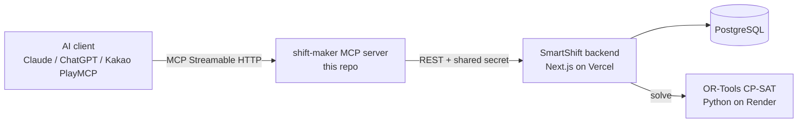

<p align="center">
  
</p>

# shift-maker — 근로기준법을 아는 근무표 편성 MCP 서버

대화만으로 법을 지키는 주간 근무표를 만듭니다. 편성은 OR-Tools CP-SAT 솔버가 맡습니다.

> 🇺🇸 [English README](README.md)

## 왜 만들었나

LLM에게 주간 근무표를 짜달라고 하면, 한 사람을 같은 시간 두 교대에 넣거나 주 52시간을 넘기거나 연소근로자를 야간에 배치한 표를 아주 자신 있게 내놓습니다. 근무표 편성은 제약충족 문제인데, 다음 토큰 예측으로 풀 문제가 아닙니다. 겉보기엔 멀쩡한데 조용히 위법인 표가 나옵니다.

shift-maker는 이 계산을 모델에게 시키지 않습니다. 대화는 사실(가게·교대·직원·제약)만 모으고, 실제 편성은 백엔드의 **OR-Tools CP-SAT** 엔진이 풉니다. 그래서 제약 안에서 *수학적으로 유효함이 보장된* 근무표를 받거나, 아니면 명확한 "편성 불가 + 사유"를 받습니다. 그럴듯해 보이는 위반은 나오지 않습니다.

## 기능

가게 등록부터 발행까지, MCP 도구 8종이 전 과정을 커버합니다.

| 도구 | 하는 일 |
| --- | --- |
| `ping` | 연결 확인. 보낸 메시지를 `pong`으로 돌려줍니다. |
| `set_store` | 가게(스케줄 세션) 생성. 교대(이름·시작·종료·필요인원)와 운영요일을 설정하고, 이후 도구에 쓸 `sessionId`를 돌려줍니다. |
| `set_employee_constraints` | 직원을 이름 기준으로 추가·수정. 주 계약일수, 근무 불가 요일, 연소근로자 여부, 고정 배정, 특정 날짜 불가를 설정합니다. |
| `generate_schedule` | 직원·가용시간·점주 규칙을 반영해 주간 근무표를 편성하고 보기 좋은 표로 돌려줍니다. |
| `get_schedule` | 이미 만들어진 근무표를 다시 조회합니다(읽기전용, 새로 편성하지 않음). |
| `create_availability_link` | 알바가 직접 이번 주 가용시간을 입력할 셀프 링크를 만듭니다. |
| `get_availability_status` | 누가 가용시간을 냈고 누가 안 냈는지 보여줍니다. |
| `publish_to_calendar` | 확정된 근무표를 점포 카카오채널 구독 캘린더로 발행합니다. |

## 근로기준법 엔진

`generate_schedule`의 `laborMode`가 근로기준법 적용 방식을 고릅니다.

| `laborMode` | 대상 | 적용 규칙 |
| --- | --- | --- |
| `full` (기본) | 5인 이상 사업장 | 주 52시간 상한, 주휴일, 연소근로자 보호 |
| `under5` | 5인 미만 사업장 | 주휴일·연소근로자 규칙 적용, 주 52시간 상한은 제외 |
| `off` | 적용제외 직종 (감시·단속적 근로, 예: 경비·소방) | 기본 유효성만(이중배정 방지), 법정 상한은 미적용 |

**연소근로자** (`isMinor: true`, 만 18세 미만): 야간(22:00~06:00) 금지, 1일 7시간·주 35시간 상한 — 모두 하드 제약으로 강제합니다.

**주휴수당:** 자동으로 회피하지 않습니다. 한 직원의 주간 배정이 15시간을 넘으면 주휴수당 발생 대상이 됩니다. shift-maker는 이 사실을 경고로 투명하게 보여줄 뿐, 임계선을 피하려고 몰래 시간을 깎지 않습니다. 판단은 점주 몫입니다.

## 이런 것도 됩니다

- **요일별 인원 차등** — 평일 야간은 2명인데 주말은 3명이 필요하다면, `day`를 붙인 교대 슬롯의 `count`가 그 요일의 총원을 대체합니다(가산이 아님).
- **직원별 고정 배정** — 특정인을 매주 같은 요일×교대에 고정합니다(예: "점장은 금·토 야간 고정").
- **특정 날짜 불가** — 하루 전체를 빼지 않고 특정 날의 특정 교대만 막습니다(예: "7/8 마감 불가").
- **자정 넘김 교대** — 종료가 시작보다 이르면 자정을 넘긴 것으로 보고 `(익일)` 표시를 붙입니다.
- **셀프 가용시간 링크** — 링크 하나를 단톡방에 공유하면 알바가 각자 자기 가용시간을 입력합니다.

## 라이브 데모

Streamable HTTP로 호스팅된 인스턴스가 떠 있습니다.

```
https://shift-maker.playmcp-endpoint.kakaocloud.io/mcp
```

연결은 세 단계입니다.

1. Claude Desktop에서 **설정 → 커넥터 → 커스텀 커넥터 추가**를 열거나 MCP Inspector를 실행합니다.
2. 위 엔드포인트 URL을 **Streamable HTTP** 서버로 붙여넣습니다.
3. 대화를 시작하면 도구가 자동으로 뜹니다.

### 검증된 3메시지 시나리오 (영화관)

아래 세 메시지면 빈 상태에서 법을 지키는 근무표와 가용시간 링크까지 완성됩니다.

1. **"우리 영화관 등록해줘. 3교대 각 2명, 주말 야간은 3명으로"**
2. **"점장, 주3일 고3, 직원 8명 등록. 점장은 금·토 야간 고정"**
3. **"2026-07-20 주 근무표 짜고, 가용시간 입력 링크도 만들어줘"**

## 아키텍처



이 저장소는 MCP 계층입니다. 백엔드·솔버는 호스티드 서비스로 돌아가며, 전체 스택을 포크한다면 `SMARTSHIFT_API_URL`을 직접 배포한 백엔드로 가리키면 됩니다.

## 로컬 실행

```bash
npm ci && npm run build
cp .env.example .env      # SMARTSHIFT_API_URL, MCP_SHARED_SECRET 설정
node dist/index.js
```

MCP Inspector로 로컬 서버에 붙습니다.

```bash
npx @modelcontextprotocol/inspector node dist/index.js
```

[카카오 AGENTIC PLAYER 10 (2026)](https://www.kakaocorp.com/) 출품작으로 만들었습니다.

## 라이선스

MIT — [LICENSE](LICENSE) 참고.
