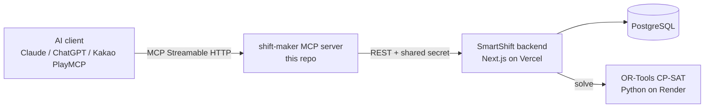

<p align="center">
  
</p>

# shift-maker — Labor-Law-Aware Shift Scheduling MCP Server

Generate legally-compliant weekly shift schedules for Korean workplaces through pure conversation — powered by OR-Tools CP-SAT.

> 🇰🇷 [한국어 README](README.ko.md)

## Why

Ask an LLM to build a weekly shift roster and it will confidently hand you one that double-books a person into two shifts at once, blows past the 52-hour weekly cap, or puts a minor on a midnight shift. Rostering is a constraint-satisfaction problem, and next-token prediction is the wrong tool for it — the answer *looks* right and is quietly illegal.

shift-maker doesn't ask the model to do the math. The conversation only collects facts (store, shifts, employees, constraints); the actual schedule is solved by an **OR-Tools CP-SAT** engine on the backend. You get either a schedule that is *provably valid* under the constraints, or a clear "infeasible + reason" — never a plausible-looking violation.

## Features

Eight MCP tools cover the full flow from store setup to publishing:

| Tool | What it does |
| --- | --- |
| `ping` | Connectivity check — echoes your message back as `pong`. |
| `set_store` | Create a store (scheduling session): shifts (name, start, end, headcount) and operating days. Returns a `sessionId` used by later tools. |
| `set_employee_constraints` | Add or update an employee by name: weekly contract days, unavailable days, minor-worker flag, fixed assignments, date-specific unavailability. |
| `generate_schedule` | Solve the weekly roster from employees, availability, and owner rules; returns a readable table. |
| `get_schedule` | Read back an already-generated schedule (read-only, never re-solves). |
| `create_availability_link` | Generate a self-serve link employees fill in to submit their availability for the week. |
| `get_availability_status` | Show who has and hasn't submitted their availability. |
| `publish_to_calendar` | Publish the confirmed roster to the store's KakaoTalk subscription calendar. |

## Labor-law engine

`generate_schedule` takes a `laborMode` that selects how the Korean Labor Standards Act is applied:

| `laborMode` | Applies to | Enforces |
| --- | --- | --- |
| `full` (default) | Workplaces with 5+ employees | 52-hour weekly cap, weekly paid rest day, minor-worker protection |
| `under5` | Workplaces with fewer than 5 employees | Weekly rest day and minor-worker rules; 52-hour cap exempted |
| `off` | Exempt roles (surveillance/intermittent work, e.g. security, firefighting) | Baseline validity only (no double-booking); statutory caps waived |

**Minor workers** (`isMinor: true`, under 18): no night work (22:00–06:00), max 7 hours/day, max 35 hours/week — all enforced as hard constraints.

**Weekly holiday allowance (주휴수당):** this is *not* auto-avoided. When an employee crosses 15 scheduled hours in a week they become eligible for the statutory paid-holiday allowance. shift-maker surfaces that fact transparently as a warning so the owner can decide — it never silently trims hours to dodge the threshold.

## Also supports

- **Day-of-week staffing overrides** — need 2 people on weekday nights but 3 on weekends? Add a shift slot with a `day` and its `count` replaces the base headcount for that day (it does not stack).
- **Per-employee fixed assignments** — pin someone to a recurring `day` × shift every week (e.g. "manager always works Friday/Saturday night").
- **Date-specific unavailability** — block a single date × shift ("can't close on 7/8") without marking the whole day off.
- **Overnight shifts** — an end time earlier than the start time is treated as crossing midnight and rendered with an `(익일)` / "next day" tag.
- **Self-serve availability links** — share one link in a group chat and each employee submits their own availability.

## Live demo

A hosted instance is live over Streamable HTTP:

```
https://shift-maker.playmcp-endpoint.kakaocloud.io/mcp
```

Connect it in three steps:

1. In Claude Desktop, open **Settings → Connectors → Add custom connector** (or launch the MCP Inspector).
2. Paste the endpoint URL above as a **Streamable HTTP** server.
3. Start chatting — the tools appear automatically.

### Verified 3-message scenario (cinema)

These three Korean messages take the server from empty to a finished, law-compliant roster plus an availability link:

1. **"우리 영화관 등록해줘. 3교대 각 2명, 주말 야간은 3명으로"**
   *"Register my cinema. Three shifts, 2 people each, but 3 on weekend nights."*
2. **"점장, 주3일 고3, 직원 8명 등록. 점장은 금·토 야간 고정"**
   *"Add a manager (3 days/week, high-school senior) and 8 staff. Pin the manager to Friday/Saturday night."*
3. **"2026-07-20 주 근무표 짜고, 가용시간 입력 링크도 만들어줘"**
   *"Build the roster for the week of 2026-07-20 and create an availability-input link."*

## Architecture



This repo is the MCP layer. The backend/solver run as a hosted service; point `SMARTSHIFT_API_URL` at your own deployment if you fork the full stack.

## Run locally

```bash
npm ci && npm run build
cp .env.example .env      # set SMARTSHIFT_API_URL and MCP_SHARED_SECRET
node dist/index.js
```

Then connect a client to the local server with the MCP Inspector:

```bash
npx @modelcontextprotocol/inspector node dist/index.js
```

Built for [Kakao AGENTIC PLAYER 10 (2026)](https://www.kakaocorp.com/).

## License

MIT — see [LICENSE](LICENSE).
